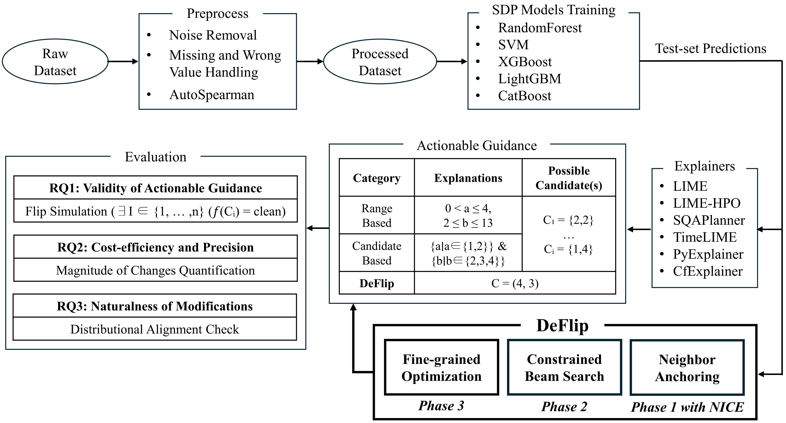

# DeFlip: Towards Trustworthy Actionable Software Defect Prediction via Fine-grained Counterfactuals – Replication Package

Replication package for the DeFlip study across release-based Software Defect Prediction (SDP) and Just-In-Time SDP (JIT-SDP), including preprocessing, model training, explainer integrations, counterfactual generation, and evaluation scripts.

## About the Paper

Software defect prediction (SDP) is increasingly expected not just to flag risky modules, but to give developers **actionable guidance** on how to change code so that predicted defects are actually resolved. Many recent SDP studies combine defect prediction with model-agnostic XAI techniques such as LIME, TimeLIME, SQAPlanner, PyExplainer, and CfExplainer, but these tools still leave a **trustworthiness gap**: they often fail to guarantee that following the suggested guidance will fix the defect, they may require unnecessarily large changes, or they propose unrealistic modifications that do not resemble real project history.

**DeFlip** is a counterfactual-explanation framework designed to bridge this gap. It anchors its search to real non-defective instances from project history, then uses constrained beam search and fine-grained optimization to find **precise, low-cost modifications** that deterministically flip a model’s prediction from “defective” to “clean” while respecting a sparsity constraint on the number of changed features. DeFlip is built on top of the Nearest Instance Counterfactual Explanations (NICE) algorithm but extends it with SDP-specific mechanisms for sparsity, realism, and precision.

This replication package evaluates DeFlip against state-of-the-art baselines across both **release-based SDP** and **Just-In-Time SDP (JIT-SDP)** scenarios, using five prediction models (Random Forest, SVM, XGBoost, LightGBM, CatBoost) and widely used datasets.

The study addresses three research questions:

* **RQ1 – Validity of actionable guidance**
  Does the guidance deterministically resolve predicted defects when applied (measured via flip simulation of model predictions)?

* **RQ2 – Cost-efficiency and precision**
  How large are the required changes for successful fixes, and does the guidance approximate the smallest modification needed to cross the decision boundary (magnitude of changes quantification)?

* **RQ3 – Naturalness of modifications**
  Are the suggested modifications statistically aligned with real historical changes in the project (distributional alignment check using multivariate distances)?

Empirical results on large-scale release-based and JIT-SDP datasets show that DeFlip provides **near-deterministic defect resolution with lower modification cost**, while preserving or improving the naturalness of suggested changes compared to existing XAI-for-SDP tools.

## Repository Structure

```text
DeFlip/
├── SDP/                         # Release-based SDP pipelines and evaluations
│   ├── Dataset/                 # Original and preprocessed release splits
│   ├── Explainer/               # LIME, LIME-HPO, TimeLIME, SQAPlanner wrappers
│   ├── models/                  # Model definitions and utilities
│   ├── cf.py / niceml.py        # DeFlip counterfactual generation
│   ├── preprocess.py            # Noise handling, missing values, AutoSpearman
│   ├── train_models*.py         # Train/evaluate RF, SVM, XGB, LGBM, CatB
│   ├── run_explainer.py         # Run range-based explainers
│   ├── generate_closest_plans.py# Actionable plan generation
│   ├── flip_exp.py              # Flip simulation (plans)
│   ├── flip_closest.py          # Flip simulation (closest plans)
│   └── evaluate_cf.py           # Aggregation for RQ1–RQ3 (release-based)
├── JIT-SDP/                     # JIT-SDP pipelines on ApacheJIT
│   ├── Dataset/                 # Commit-level data and splits
│   ├── Explainer/               # PyExplainer, CfExplainer integrations
│   ├── cf.py                    # DeFlip counterfactual generation
│   ├── preprocess_jit.py        # JIT preprocessing and feature prep
│   ├── train_models_jit.py      # Train/evaluate RF, SVM, XGB, LGBM, CatB
│   ├── run_explainer.py         # LIME / LIME-HPO explainers
│   ├── run_cfexp.py / run_pyexp.py # Candidate-based explainers
│   ├── plan_explanations.py     # Plan construction for full guidance from range explainers
│   ├── plan_final.py / plan_closest.py # Plans for candidate explainers / closest (minimum-change) guidance
│   ├── flip_exp.py              # Flip simulation (plans)
│   ├── flip_closest.py          # Flip simulation (closest plans)
│   └── evaluate_final.py        # Aggregation for RQ1–RQ3 (JIT-SDP)
├── plot_rq1.py / plot_rq2.py / plot_rq3.py  # Figure regeneration scripts
├── replication_cli.py           # Unified CLI entry point for all experiments
├── requirements.txt             # Python dependencies
└── Figure_2.png                 # Overview of the experimental design
```

`SDP/` and `JIT-SDP/` correspond to release-based and JIT-SDP experiments. Each folder contains preprocessing, model training, and explainer/counterfactual modules that map directly onto the workflow described below. The RQ aggregation scripts feed into `plot_rq*.py` to regenerate the figures and tables referenced in the paper (see [Mapping from Scripts to Figures, Tables, and RQs](#mapping-from-scripts-to-figures-tables-and-rqs)).

## Experimental Workflow (High-Level)



Figure 2 summarizes the end-to-end workflow. Each step below links directly to the corresponding scripts so reviewers can jump from the diagram to runnable code.

1. **Raw dataset → Preprocessing** ([`SDP/preprocess.py`](SDP/preprocess.py), [`JIT-SDP/preprocess_jit.py`](JIT-SDP/preprocess_jit.py))
   * Start from raw release-based SDP datasets and the ApacheJIT JIT-SDP dataset.
   * Clean and prepare the data by removing noise, handling missing or incorrect values, and applying **AutoSpearman** feature selection to drop highly correlated features.
   * Output: processed datasets for each project/domain.

2. **SDP model training** ([`SDP/train_models.py`](SDP/train_models.py), [`SDP/train_models_new.py`](SDP/train_models_new.py), [`JIT-SDP/train_models_jit.py`](JIT-SDP/train_models_jit.py))
   * Train five defect prediction models on the processed datasets: **Random Forest, SVM, XGBoost, LightGBM, CatBoost**.
   * Use release-to-release prediction for release-based SDP and an 80/20 split for JIT-SDP.

3. **Test-set prediction** (integrated in the training scripts above)
   * Apply trained models to the test set to obtain defect predictions.
   * Focus on **true positive** defective instances as seeds for actionable guidance.

4. **Actionable guidance generation (baseline explainers + DeFlip)** ([`SDP/run_explainer.py`](SDP/run_explainer.py), [`JIT-SDP/run_explainer.py`](JIT-SDP/run_explainer.py), [`JIT-SDP/run_cfexp.py`](JIT-SDP/run_cfexp.py), [`JIT-SDP/run_pyexp.py`](JIT-SDP/run_pyexp.py), [`SDP/cf.py`](SDP/cf.py), [`JIT-SDP/cf.py`](JIT-SDP/cf.py))
   * For each predicted defective instance, generate guidance using:
     * **Range-based explainers:** LIME, LIME-HPO, TimeLIME, SQAPlanner
     * **Candidate-based explainers:** PyExplainer, CfExplainer
     * **DeFlip counterfactuals**
   * Convert explanations into actionable plans for flip simulation via [`JIT-SDP/plan_explanations.py`](JIT-SDP/plan_explanations.py) or [`JIT-SDP/plan_final.py`](JIT-SDP/plan_final.py); use [`JIT-SDP/plan_closest.py`](JIT-SDP/plan_closest.py) when evaluating closest/minimum-change guidance.

5. **DeFlip’s three phases** ([`SDP/cf.py`](SDP/cf.py), [`SDP/niceml.py`](SDP/niceml.py), [`JIT-SDP/cf.py`](JIT-SDP/cf.py))
   * **Phase 1 – Neighbor Anchoring (with NICE):** Use NICE to find the nearest non-defective instance in training data via HEOM distance; this anchor grounds the search in real project history.
   * **Phase 2 – Constrained Beam Search:** Starting from the defective instance, perform beam search toward the anchor while changing at most **K features**, retaining only candidates that flip the prediction to “clean” within the sparsity budget.
   * **Phase 3 – Fine-grained Optimization:** Incrementally pull each modified feature back toward its original value (binary search) until just inside the non-defective region, minimizing change magnitude while preserving the flip.

6. **Evaluation (RQ1–RQ3)** ([`SDP/flip_exp.py`](SDP/flip_exp.py), [`SDP/flip_closest.py`](SDP/flip_closest.py), [`SDP/evaluate_cf.py`](SDP/evaluate_cf.py), [`JIT-SDP/flip_exp.py`](JIT-SDP/flip_exp.py), [`JIT-SDP/flip_closest.py`](JIT-SDP/flip_closest.py), [`JIT-SDP/evaluate_final.py`](JIT-SDP/evaluate_final.py), [`JIT-SDP/evaluate_closest.py`](JIT-SDP/evaluate_closest.py), [`plot_rq1.py`](plot_rq1.py), [`plot_rq2.py`](plot_rq2.py), [`plot_rq3.py`](plot_rq3.py))
   * **RQ1 – Validity of actionable guidance:** Flip simulation on model predictions; compute flip rate and exploration depth.
   * **RQ2 – Cost-efficiency and precision:** Measure change magnitude for successful flips under the sparsity constraint.
   * **RQ3 – Naturalness of modifications:** Compare suggested changes to historical modifications using multivariate distance (e.g., Mahalanobis).

## Mapping from Scripts to Figures, Tables, and RQs

| Script / Path | Purpose | Figures / Tables | Related RQ(s) | Notes |
|---------------|---------|------------------|---------------|-------|
| `SDP/preprocess.py` | Preprocess release-based SDP datasets (noise handling, AutoSpearman) feeding all downstream analyses. | Supports all release-based figures/tables | RQ1, RQ2, RQ3 | Run once before SDP experiments. |
| `SDP/train_models.py` & `SDP/train_models_new.py` | Train/evaluate RandomForest, SVM, XGBoost, LightGBM, CatBoost for release-based SDP. | Supports all release-based figures/tables | RQ1, RQ2, RQ3 | Include `train_models_new.py` for LightGBM/CatBoost. |
| `SDP/run_explainer.py` & `SDP/generate_closest_plans.py` | Run LIME/LIME-HPO/TimeLIME/SQAPlanner and derive actionable plans. | Figures for release-based plan baselines (RQ1–RQ2 tables/plots) | RQ1, RQ2 | SQAPlanner requires rule mining via `SDP/mining_sqa_rules.py`. |
| `SDP/cf.py` & `SDP/niceml.py` | Generate DeFlip/NICE counterfactuals for release-based SDP. | DeFlip lines in release-based figures/tables | RQ1, RQ2 | Use after model training; configurable sparsity and distance metrics. |
| `SDP/flip_exp.py` & `SDP/flip_closest.py` | Flip simulation for plan-based guidance (full vs closest plans). | Release-based RQ1 flip-rate figures/tables | RQ1 | `flip_closest.py` uses smallest-change plans. |
| `SDP/evaluate_cf.py` | Aggregate flip rates, change magnitudes, and naturalness metrics across explainers/models. | Release-based RQ1–RQ3 tables/plots | RQ1, RQ2, RQ3 | Inputs consumed by `plot_rq*.py`. |
| `JIT-SDP/preprocess_jit.py` | Preprocess ApacheJIT commits for JIT-SDP. | Supports all JIT-SDP figures/tables | RQ1, RQ2, RQ3 | Run once before JIT experiments. |
| `JIT-SDP/train_models_jit.py` | Train/evaluate JIT-SDP classifiers. | Supports all JIT-SDP figures/tables | RQ1, RQ2, RQ3 | Shares model set with release-based experiments. |
| `JIT-SDP/run_explainer.py`, `JIT-SDP/run_cfexp.py`, `JIT-SDP/run_pyexp.py` | Run LIME/LIME-HPO (range) and CfExplainer/PyExplainer (candidate) explainers for JIT. | JIT-SDP plan baseline figures/tables (RQ1–RQ2) | RQ1, RQ2 | CfExplainer/PyExplainer require dedicated runners. |
| `JIT-SDP/plan_explanations.py` | Convert range-based JIT explanations into full actionable plans. | JIT-SDP RQ1 flip-rate and RQ2 cost figures/tables | RQ1, RQ2 | Primary path for LIME/LIME-HPO plans. |
| `JIT-SDP/plan_final.py` | Build plans for candidate-based explainers (CfExplainer/PyExplainer). | JIT-SDP RQ1 flip-rate and RQ2 cost figures/tables | RQ1, RQ2 | Use before flip simulations for candidate explainers. |
| `JIT-SDP/plan_closest.py` | Generate closest/minimum-change plans across JIT explainers. | JIT-SDP RQ1 flip-rate and RQ2 cost figures/tables | RQ1, RQ2 | Run when you need minimum-guidance/closest-plan evaluation. |
| `JIT-SDP/cf.py` | Generate DeFlip counterfactuals for JIT-SDP. | DeFlip lines in JIT-SDP figures/tables | RQ1, RQ2 | Shares sparsity/distance options with SDP. |
| `JIT-SDP/flip_exp.py` & `JIT-SDP/flip_closest.py` | Flip simulation for JIT plans (full vs closest). | JIT-SDP RQ1 flip-rate figures/tables | RQ1 | Add `--get_flip_rate` for aggregate-only runs. |
| `JIT-SDP/evaluate_final.py` & `JIT-SDP/evaluate_closest.py` | Aggregate JIT flip rates, change magnitudes, and naturalness metrics. | JIT-SDP RQ1–RQ3 tables/plots | RQ1, RQ2, RQ3 | Use `evaluate_closest.py` for smallest-change plan pipeline. |
| `plot_rq1.py`, `plot_rq2.py`, `plot_rq3.py` | Regenerate combined figures from cached evaluation CSVs. | RQ1–RQ3 figures in the paper | RQ1, RQ2, RQ3 | Reads outputs from `evaluate_*` scripts. |

## How to Reproduce the Experiments

1. **Environment setup**
   * Python 3.10+ is recommended.
   * Install dependencies:
     ```bash
     pip install -r requirements.txt
     ```
   * (Release-based preprocessing) Install the R package [`Rnalytica`](https://cran.r-project.org/package=Rnalytica) and ensure `rpy2` can locate your R installation.

2. **Configure datasets**
   * Update dataset paths in `SDP/hyparams.py` and `JIT-SDP/hyparams.py` to point to your local copies (raw CSVs and preprocessed splits).

3. **Quick-start smoke test**
   * Run a compact JIT-SDP end-to-end test (train → explain → plan → flip → evaluate) on the default settings:
     ```bash
     python replication_cli.py jit run-all --projects all --models RandomForest --explainers LIME-HPO --closest
     ```
   * Use the script–figure mapping above to decide which full-scale commands to run for each figure/table.

### Reproducing RQ1 (Validity of Actionable Guidance)

* **Release-based SDP:**
  1. Preprocess and train models:
     ```bash
     python replication_cli.py sdp preprocess
     python replication_cli.py sdp train-models --include-extended-models
     ```
  2. Run explainers and plans (example with LIME-HPO):
     ```bash
     python replication_cli.py sdp explain --model-type RandomForest --explainer-type LIME-HPO --project all
     python replication_cli.py sdp plan-actions --model-type RandomForest --explainer-type LIME-HPO --project all
     ```
  3. Flip simulation and aggregation for RQ1 figures/tables:
     ```bash
     python replication_cli.py sdp flip --model-type RandomForest --explainer-type LIME-HPO --project all
     python replication_cli.py sdp evaluate --rq1 --explainer all --models all --projects all
     ```

* **JIT-SDP:**
  1. Preprocess and train:
     ```bash
     python replication_cli.py jit train-models
     ```
  2. Run explainers and plans (example with CfExplainer):
     ```bash
     python replication_cli.py jit explain --model-type RandomForest --explainer-type CfExplainer --project all
     python replication_cli.py jit plan-actions --model-type RandomForest --explainer-type CfExplainer --project all
     ```
  3. Flip simulation and aggregation for RQ1 figures/tables:
     ```bash
     python replication_cli.py jit flip --model-type RandomForest --explainer-type CfExplainer --project all
     python replication_cli.py jit evaluate --rq1 --explainer all --models all --projects all
     ```

### Reproducing RQ2 (Cost-efficiency and Precision)

* After completing RQ1 steps, reuse the same flip outputs and run the evaluations that quantify change magnitudes:
  * **Release-based SDP:**
    ```bash
    python replication_cli.py sdp evaluate --rq2 --explainer all --models all --projects all
    ```
  * **JIT-SDP:**
    ```bash
    python replication_cli.py jit evaluate --rq2 --explainer all --models all --projects all
    ```

### Reproducing RQ3 (Naturalness of Modifications)

* Ensure flip experiments are completed, then run the RQ3 aggregation to compute Mahalanobis (or cosine) distances between suggested changes and historical modifications:
  * **Release-based SDP:**
    ```bash
    python replication_cli.py sdp evaluate --rq3 --distance mahalanobis --explainer all --models all --projects all --use-default-groups
    ```
  * **JIT-SDP:**
    ```bash
    python replication_cli.py jit evaluate --rq3 --distance mahalanobis --explainer all --models all --projects all --use-default-groups
    ```

### Counterfactual (DeFlip) Generation

* To generate DeFlip/NICE counterfactuals directly (used alongside plan-based outputs):
  ```bash
  python replication_cli.py sdp counterfactuals --project all --model-types RandomForest,SVM,XGBoost --max-features 5 --distance unit_l2
  python replication_cli.py jit flip --model-type RandomForest --explainer-type CF --project all --get-flip-rate
  ```
* Adjust `--max-features` (sparsity budget), `--distance`, and `--nice-distance-metric` as needed.

## Command-Line Interface Reference

`replication_cli.py` wraps all study scripts with consistent options. Run `python replication_cli.py --help` or add `--help` to any subcommand for full details.

### Global structure

```bash
python replication_cli.py {jit|sdp} <command> [options]
```

### JIT-SDP commands

* `train-models` – Train or evaluate JIT classifiers. Add `--evaluate-only` to skip retraining.
* `explain` – Run explainers (`--explainer-type {LIME,LIME-HPO,CfExplainer,PyExplainer}`) for specified models/projects.
* `plan-actions` – Convert explainer outputs into actionable plans. Use `--closest` for minimum-change plans or `--compute-importance` for feature importance instead of plans.
* `flip` – Apply plans or counterfactuals to test true positives (`--get-flip-rate` aggregates only; `--fresh` recomputes flips; `--closest` reads closest-plan outputs).
* `evaluate` – Aggregate RQ metrics (`--rq1`, `--rq2`, `--rq3`, `--implications`) with optional `--distance {mahalanobis,cosine}` and `--use-default-groups` for RQ3 grouping.
* `run-all` – Full JIT pipeline across selected models/explainers/projects; supports `--closest` and `--evaluate-only`.

### Release-based SDP commands

* `preprocess` – Prepare release datasets (noise handling, missing-value fixes, AutoSpearman feature selection).
* `train-models` – Train or evaluate SDP classifiers. Add `--include-extended-models` to also fit LightGBM and CatBoost.
* `explain` – Run range-based explainers (`--explainer-type {LIME,LIME-HPO,TimeLIME,SQAPlanner}`).
* `plan-actions` – Build actionable plans from explanations; optionally compute importance ratios with `--compute-importance`.
* `mine-rules` – Required for SQAPlanner: mine association rules via BigML (`.env` must supply `BIGML_USERNAME` and `BIGML_API_KEY`).
* `counterfactuals` – Generate DeFlip/NICE counterfactuals with sparsity and distance controls (`--max-features`, `--exact-k`, `--distance`, `--nice-distance-metric`, `--overwrite`).
* `flip` – Apply plans to test true positives (`--fresh` recomputes flips; `--get-flip-rate` aggregates only; `--closest` uses minimum-change plans).
* `evaluate` – Aggregate RQ metrics (`--rq1`, `--rq2`, `--rq3`, `--implications`) and compute distances for RQ3.
* `run-all` – Full SDP pipeline with options to `--skip-preprocess`, `--skip-training`, `--include-counterfactuals`, `--include-extended-models`, and `--closest`.

Use the workflow and mapping tables above to select the command combinations that reproduce specific figures and tables.

### Authors
* Gichan Lee, Hanyang University (fantasyopy@hanyang.ac.kr)
* Joonwoo Lee, Hanyang University (joonywlee@hanyang.ac.kr)
* Scott Uk-Jin Lee, Hanyang University(scottlee@hanyang.ac.kr)
  
@article{lee2025deflip,
  title={DeFlip: Towards Trustworthy Actionable Software Defect Prediction via Fine-grained Counterfactuals},
  author={Lee, Gichan and Lee, Joonwoo and Lee, Scott Uk-Jin},
  journal={Empirical Software Engineering},
  year={2025},
  note={Under Review}
}
