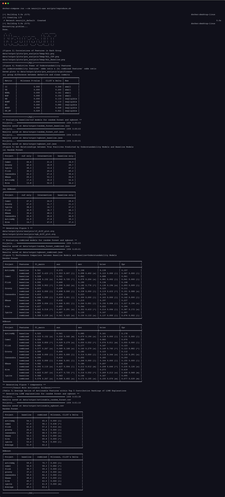

# NeuroJIT Replication Package

This document introduces the replication package for the paper titled *NeuroJIT: Improving Just-In-Time Defect Prediction Using Neurophysiological and Empirical Perceptions of Modern Developers* and provides detailed instructions on its usage. The package contains the core modules of NeuroJIT, along with the scripts and datasets required to replicate the results presented in the paper. This package can be used to reproduce the paper’s results or to implement a customized version of NeuroJIT for experiments tailored to your specific needs. If you have any questions about the package or the content of the paper, please do not hesitate to contact us via email at fantasyopy@hanyang.ac.kr or sparky@hanyang.ac.kr.

## License

This project is licensed under the Apache License 2.0 - see the [LICENSE](LICENSE) file for details.

## Contents

- [1. Brief Descriptions of the Replication Package](#1-brief-descriptions-of-the-replication-package)
  - [Structure](#structure)
  - [Dataset](#dataset)
  - [NeuroJIT](#neurojit)
- [2. Step-by-step Explanations for NeuroJIT Replication](#2-step-by-step-explanations-for-neurojit-replication)
  - [2-1. Setup](#2-1-setup)
    - [1) Hardware/Software Requirements](#1-hardwaresoftware-requirements)
    - [2) Docker Setup](#2-docker-setup)
  - [2-2. Usage](#2-2-usage)
    - [1) Reproducing the Experimental Results](#1-reproducing-the-experimental-results)
    - [2) Additional Experiments for the Validity](#2-additional-experiments-for-the-validity)
    - [3) An Example of NeuroJIT Usage](#3-an-example-of-neurojit-usage)
- [3. Customizing NeuroJIT](#3-customizing-neurojit)

## 1. Brief Descriptions of the Replication Package (NeuroJIT.zip)

### Structure

```Shell
├── archive # zipped trained models (pickles) in our experiment
├── data
│  ├── dataset # dataset used in the experiments
│  ├── output # output of the experiments
│  └── plots  # plots generated in the experiments
├── dist # neurojit package distribution
├── Dockerfile
├── docker-compose.yml
├── src/neurojit # core module
└── scripts 
# main scripts
   ├── data_utils.py # data preprocessing and caching
   ├── calculate.py # calculate commit understandability features and LT of Kamei et al.
   ├── pre_analysis.py # analyze statistics of the dataset
   ├── jit_sdp.py # machine learning algorithm training and evaluation for just-in-time defect prediction
   ├── analysis.py # analyze the ML models
# sub-modules
   ├── correlation.py # modules for correlation analysis
   ├── environment.py # environment variables for main scripts
   ├── visualization.py # visualization tools
# for replication
   ├── reproduce.sh # a script to reproduce the major experimental results of the paper
   ├── commit_distribution.ipynb # a notebook for commit distribution analysis (external validity)
   └── neurojit_cli.py # an example of utilizing NeuroJIT for user's objectives
```

### Dataset

Our dataset includes widely adopted just-in-time defect prediction features as well as the commit understandability features of NeuroJIT, derived from a total of eight Apache projects. Each CSV file in the `data/dataset` directory represents intermediate outputs generated at data preprocessing stages described in the paper, while each CSV file in the `combined` directory represents the final output for each project.

```Shell
data/dataset
├── apachejit_total.csv # original ApacheJIT dataset
├── apachejit_date.csv # ApacheJIT dataset with bug_fix_date
├── apachejit_gap.csv # gap between commit date and bug_fix_date in ApacheJIT dataset
├── apache_metrics_kamei.csv # traditional just-in-time features in ApacheJIT dataset
├── baseline/  # LT added and preprocessed ApacheJIT dataset
│  ├── activemq.csv
│  ├── ...
├── combined/*.csv   # the dataset used in the research
└── cuf/*.csv      # 9 commit understandability features of target commits
```

If you wish to build the dataset from scratch, the following scripts can be used:

```Shell
 (1) Usage: python scripts/data_utils.py COMMAND [ARGS]...

 Data preprocessing and caching

╭─ Commands ────────────────────────────────────────────────────────────────────────────────────────────────────────────────────╮
│ combine-dataset   Combine the baseline and commit understandability features datasets                                         │
│ filter-commits    Filter method changes for each commit in the dataset and save methods to cache                              │
│ prepare-data      ApacheJIT (bug_date column added) dataset                                                                   │
│ save-methods      Save the change contexts for commits that modified existing methods                                         │
╰───────────────────────────────────────────────────────────────────────────────────────────────────────────────────────────────╯

 (2) Usage: python scripts/calculate.py COMMAND [ARGS]...

 Calculate metrics for CUF and Baseline

╭─ Commands ────────────────────────────────────────────────────────────────────────────────────────────────────────────────────╮
│ cuf-all       Calculate all commit understandability features for a project                                                   │
│ cuf-metrics   Calculate specific commit understandability features metrics for a project                                      │
│ lt            Calculate LT for apachejit_metrics (baseline)                                                                   │
╰───────────────────────────────────────────────────────────────────────────────────────────────────────────────────────────────╯
```

### NeuroJIT

The `neurojit` module offers commit understandability feature calculators and the implementation of the sliding window method. The module is structured as follows:

```Shell
src/neurojit
├── commit.py # commit filtering and saving
├── cuf
│  ├── cfg.py # control flow graph for DD
│  ├── halstead.py # halstead metrics
│  ├── metrics.py  # commit understandability features calculation 
│  └── rii.py # II feature calculation with Checkstyle
└── tools
    └── data_utils.py # the implementation of sliding window method for chronological order, verification latency, and concept drifts
```

`neurojit` is available at [PyPI](https://pypi.org/project/neurojit/), and you can install it using the following command:

```Shell
$ pip install neurojit
```
Now, you can use the NeuroJIT module in your Python project.

If you want to install all the dependencies for the replication package, add the `[replication]` option:
```Shell
$ pip install neurojit[replication]
```


## 2. Step-by-step Explanations for NeuroJIT Replication
### 2-1. Setup

#### 1) Hardware/Software Requirements

We tested the replication package on the following devices:

 - Windows 11
   - CPU: AMD Ryzen 5 5600X
   - RAM: 32GB
 - Ubuntu 20.04.6
   - Device: NVIDIA DGX Station V100, 2019
   - CPU: Intel Xeon(R) E5-2698 v4 @ 2.20GHz
   - RAM: 256GB
 - MacOS 14.6.1
   - Device: MacBook Air M2, 2022
   - CPU: Apple M2
   - RAM: 24GB
 - Docker version 4.33.1
  
#### 2) Docker Setup

To install Docker, refer to the official installation guide at [https://docs.docker.com/get-docker/](https://docs.docker.com/get-docker/). 
After downloading and extracting `NeuroJIT.zip`, navigate to the directory via CLI. 
To build the image using `docker-compose`, execute the following command:

```Shell
$ docker-compose build
...

$ docker image ls
REPOSITORY     TAG       IMAGE ID       CREATED          SIZE
neurojit-ase   latest    12e828b38d59   18 seconds ago   3.57GB
```

Or you can build the image and run the replication script in one command:

```Shell
$ docker-compose up --build
...
✔ Container neurojit-ase  Started
Attaching to neurojit-ase
...
```

`neurojit-ase` container is created and `scripts/reproduce.sh` is executed automatically.


### 2-2. Usage

#### 1) Reproducing the Experimental Results

After you build the image, to reproduce the major results of the paper, execute the following command:

```Shell
$ docker-compose run --rm neurojit-ase scripts/reproduce.sh # or docker-compose up 
``` 

If the script is executed successfully, you can see the identical results as `reproduced_results.png`:



In addition to the tables shown in the capture, you can find the figures in the saved directory.

For a detailed explanation of reproduce.sh, please refer to `reproduce_sh.md`.

#### 2) Additional Experiments for the Validity

1) The result presented in Figure 5 on page 7 of the paper, which demonstrates that commit understandability features provide exclusive information, applies to all positives, not just true positives. You can verify the results for all positives by executing the following commands with the `--no-only-tp` option:

    ```Shell
    $ docker-compose run --rm neurojit-ase python scripts/analysis.py table-set-relationships data/output/random_forest_cuf.json data/output/random_forest_baseline.json --fmt fancy_outline --no-only-tp

    ╒═══════════╤════════════╤════════════════╤═════════════════╕
    │ Project   │   cuf only │   Intersection │   baseline only │
    ╞═══════════╪════════════╪════════════════╪═════════════════╡
    │ Groovy    │       58.2 │           15.7 │            26.1 │
    │ Camel     │       53.7 │           17.9 │            28.4 │
    │ Flink     │       47.1 │           13.4 │            39.5 │
    │ Ignite    │       41.9 │           10.2 │            47.9 │
    │ Cassandra │       33.8 │           17.2 │            48.9 │
    │ HBase     │       31.4 │           35.6 │            33.0 │
    │ ActiveMQ  │       30.3 │           14.7 │            54.9 │
    │ Hive      │       29.8 │           40.3 │            29.9 │
    ╘═══════════╧════════════╧════════════════╧═════════════════╛

    $ docker-compose run --rm neurojit-ase python scripts/analysis.py table-set-relationships data/output/xgboost_cuf.json data/output/xgboost_baseline.json --fmt fancy_outline --no-only-tp

    ╒═══════════╤════════════╤════════════════╤═════════════════╕
    │ Project   │   cuf only │   Intersection │   baseline only │
    ╞═══════════╪════════════╪════════════════╪═════════════════╡
    │ Groovy    │       60.2 │           15.9 │            23.9 │
    │ Camel     │       57.2 │           17.0 │            25.8 │
    │ Flink     │       49.3 │           13.0 │            37.7 │
    │ Ignite    │       45.0 │           10.1 │            44.9 │
    │ Cassandra │       40.4 │           18.2 │            41.4 │
    │ HBase     │       39.8 │           31.6 │            28.6 │
    │ ActiveMQ  │       34.9 │           16.0 │            49.1 │
    │ Hive      │       29.2 │           37.9 │            32.9 │
    ╘═══════════╧════════════╧════════════════╧═════════════════╛
    ```
2) To obtain the results mentioned in the External Validity section on page 10 of the paper, which states that the dataset used in this study shows a different distribution compared to the dataset used in cited study, execute the following commands:
  
    ```Shell
    $ docker-compose run --rm neurojit-ase python scripts/pre_analysis.py plot-commit-distribution --ours

    Saved plot to data/plots/commit_distribution_ours.png

    $ docker-compose run --rm neurojit-ase python scripts/pre_analysis.py plot-commit-distribution

    Saved plot to data/plots/commit_distribution_apachejit.png
    ```

    Please check the figures saved in the corresponding directory.

#### 3) An Example of NeuroJIT Usage

NeuroJIT is currently designed to calculate commit understandability features from method-level commits of projects. You can calculate the features using the following `neurojit_cli.py` script:

```Shell
$ docker-compose run --rm neurojit-ase python scripts/neurojit_cli.py calculate --project REPONAME --commit-hash COMMIT_HASH
```

For example, to calculate the features for the `8f40a7` commit in the `ActiveMQ` project, execute the following command:

```Shell
$ docker-compose run --rm neurojit-ase python scripts/neurojit_cli.py calculate --project activemq --commit-hash 8f40a7

{'NOGV': 1.0, 'MDNL': 0.0, 'TE': 3.5122864969277017, 'II': 0.03225806451612903, 'NOP': 0.0, 'NB': 0.0, 'EC': 0.5, 'DD_HV': 0.04324106779539902, 'NOMT': 9.0}
```

If the commit is not a method changes commit, you will see a message like this:

```Shell
$ docker-compose run --rm neurojit-ase python scripts/neurojit_cli.py calculate --project groovy --commit-hash 7b84807

Target commit is not a method changes commit
```

If the commits are at the method level, you can still extract the commit understandability features even if the project is not included in our dataset. Please refer to the example below.

```Shell
$ docker-compose run --rm neurojit-ase python scripts/neurojit_cli.py calculate --project spring-projects/spring-framework --commit-hash 0101945

{'NOGV': 0.6, 'MDNL': 0.0, 'TE': 4.623781958476344, 'II': 0.9166666666666666, 'NOP': 1.0, 'NB': 0.0, 'EC': 0.3333333333333333, 'DD_HV': 0.04484876484351509, 'NOMT': 17.0}
```

## 3. Customizing NeuroJIT

To modify NeuroJIT and conduct custom experiments, you can extend the neurojit module by referring to the scripts described above. Below are the key modules you should consider to customize NeuroJIT:

- `neurojit.commit.py`: The function `Mining.only_method_changes(repo, commit_hash)` filters commits that only modify methods and saves the method bodies to the cache. You can modify this function to use other filtering methods.
- `neurojit.cuf.metrics.py`: The `MethodUnderstandabilityFeatures` and `CommitUnderstandabilityFeatures` classes calculate commit understandability features of method-level commits. You can modify these classes if you wish to change the detailed methodology for extracting the features.
- `scripts/environment.py`: This script includes the environment variables used in the scripts. You can modify the environment variables to perform custom experiments.
